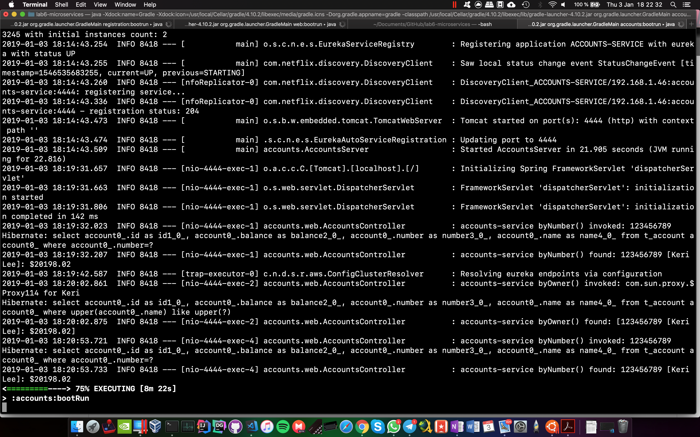

# The two microservices are running and registered (two terminals, logs screenshots)
Description | Web interface |  Logs
:-------------------------:|:-------------------------:|:-------------------------:
Account microservice |  | 
Web microservice |  | 

# The service registration service has the two microservices registered (a third terminal, dashboard screenshots)
Description | Web interface |  Logs
:-------------------------:|:-------------------------:|:-------------------------:
Eureka server |  | 

# A second account microservice is running in the port 4444 and it is registered (a fourth terminal, log screenshots).
The [application.yml](./accounts/src/main/resources/application.yml) file of the account microservice was modified with the port 4444 instead of the 2222.

Web interface
:-------------------------:

Log (registration microservice)
:-------------------------:

Log (accounts microservice)
:-------------------------:

# A brief report describing what happens when you kill the microservice with port 2222. Can the web service provide information about the accounts? Why?
Yes, the service will still work because, as the Eureka dashboard shows, there is still one ACCOUNTS-SERVICE service running (The log screenshot below shows how the backup service has handled the new query).

Web interface
:-------------------------:

Log (accounts microservice)
:-------------------------:
